# 🔌 Learning Arduino

Twenty activities working up from blinking one LED to driving an LCD, an ultrasonic rangefinder, and an IR remote — the groundwork for my [Arduino final project](https://github.com/ThaiBenjamin/arduino-obstacle-detector).


---

## ✨ What's Here

Each `activityN.ino` is one self-contained sketch, kept exactly as it ran on the board. They are ordered, and they build on each other: every technique introduced here shows up again in the final project.

- **Digital and analog output** — `digitalWrite`, PWM via `analogWrite`
- **Digital and analog input** — pushbuttons, potentiometers, photoresistors
- **Non-blocking timing** — replacing `delay()` with `millis()` so several things can happen at once
- **Debouncing** — both the `delay()` way and the timestamp way
- **Hardware interrupts** — `attachInterrupt` on button presses and on an echo pin
- **Serial protocol** — reading typed input to retune a running sketch without reflashing
- **EEPROM** — settings that survive a power cycle
- **Peripherals** — HC-SR04 ultrasonic sensor, 16×2 LCD, IR receiver + remote

---

## 🛠️ Hardware

| Component | Used in |
|---|---|
| Elegoo UNO R3 (Arduino UNO clone) | All |
| Breadboard + jumper wires | All |
| LEDs (red / yellow / green) + 220Ω resistors | 1–13, 15, 18, 19 |
| Pushbutton | 3, 6, 7, 10, 11, 12 |
| Potentiometer | 4, 10, 13 |
| HC-SR04 ultrasonic sensor | 14, 15, 17 |
| 16×2 LCD (LiquidCrystal, 4-bit mode) | 16, 17, 18 |
| IR receiver + remote | 18 |
| Photoresistor | 19, 20 |

---

## 🚀 Setup & Running

### Prerequisites
- [Arduino IDE](https://www.arduino.cc/en/software) 2.x
- An Arduino UNO (or clone) and the parts above
- Libraries via **Sketch → Include Library → Manage Libraries**:
  - `LiquidCrystal` (bundled with the IDE) — activities 16–18
  - `IRremote` by shirriff — activity 18

### Running an activity

```bash
git clone https://github.com/ThaiBenjamin/LearningArduino.git
cd LearningArduino
```

Open any `activityN.ino` in the Arduino IDE, select **Tools → Board → Arduino UNO** and the right port, then upload.

> Activities 1, 8, 9, 10, 12, 13, 14, 15, 16 and 20 print to or read from the Serial Monitor. Match the baud rate at the top of the sketch — most use **115200**, activity 1 uses **9600**.

---

## 📚 The Activities

### Phase 1 — Output: on/off, then in between

| # | Sketch | What it does |
|---|---|---|
| 01 | [`activity1.ino`](activity1.ino) | Blink the on-board LED on pin 13 and log each transition over serial |
| 02 | [`activity2.ino`](activity2.ino) | Fade an LED up and down with PWM, stepping `analogWrite` 0→255→0 |

Activity 1 is the whole point of starting here — the first time something I wrote changed a physical object.

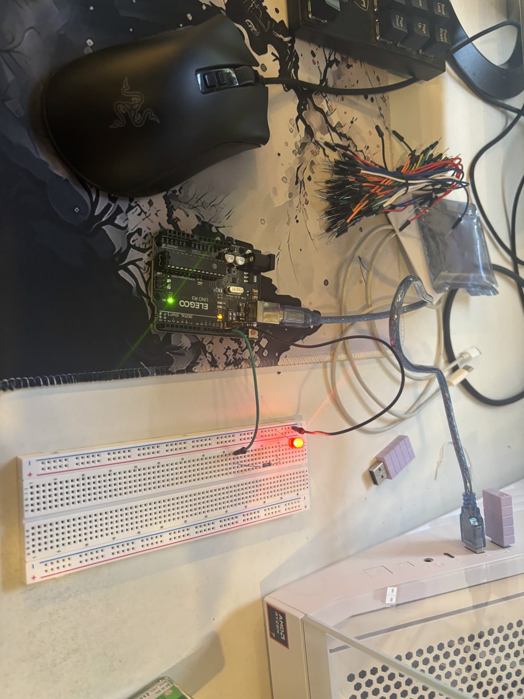

The fade is the first sketch where the LED is not simply on or off. PWM switches the pin faster than the eye resolves, and the duty cycle reads as brightness:

[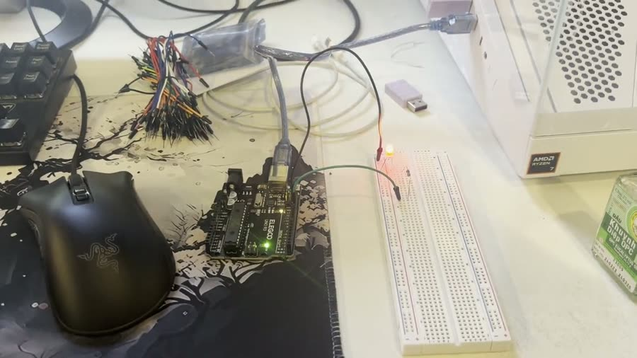](media/02-led-fade.mp4)

▶ **[Play the clip](media/02-led-fade.mp4)** — PWM switches the pin faster than the eye resolves, and the duty cycle reads as brightness.

---

### Phase 2 — Input: buttons and the potentiometer

| # | Sketch | What it does |
|---|---|---|
| 03 | [`activity3.ino`](activity3.ino) | Read a pushbutton with `digitalRead` and mirror its state onto an LED |
| 04 | [`activity4.ino`](activity4.ino) | Read a potentiometer on A2 and map 0–1023 onto an LED's 0–255 brightness |
| 10 | [`activity10.ino`](activity10.ino) | All three at once: one LED blinking on `millis()`, one on the potentiometer, one on the button |

The LED rig from Phase 1, rebuilt that evening with the IDE open and the sketch driving it directly:

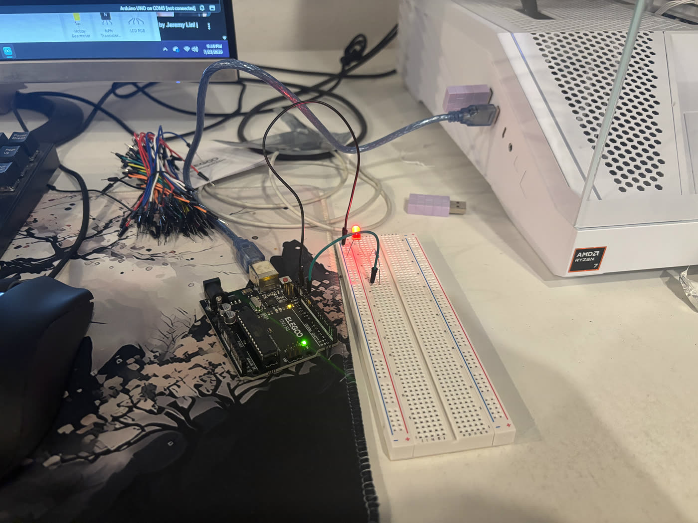

[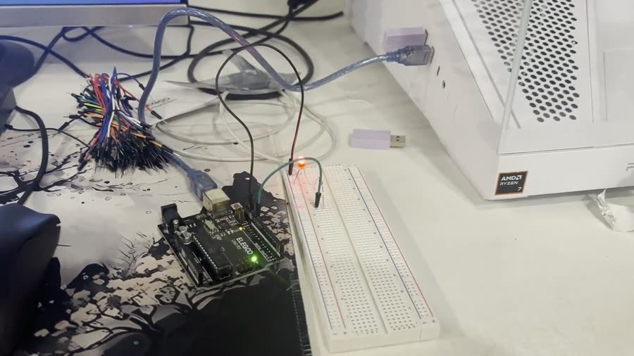](media/03-led-switching.mp4)

▶ **[Play the clip](media/03-led-switching.mp4)** — The LED driven straight from the sketch.

Then the button goes in. Nothing is lit until the circuit is closed:

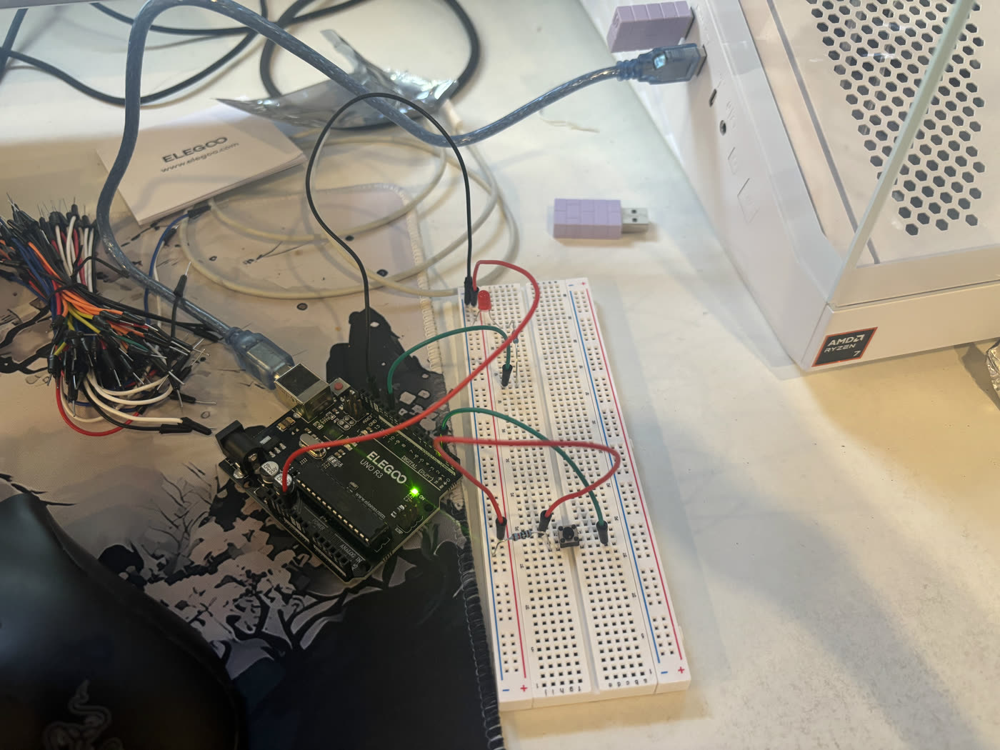

[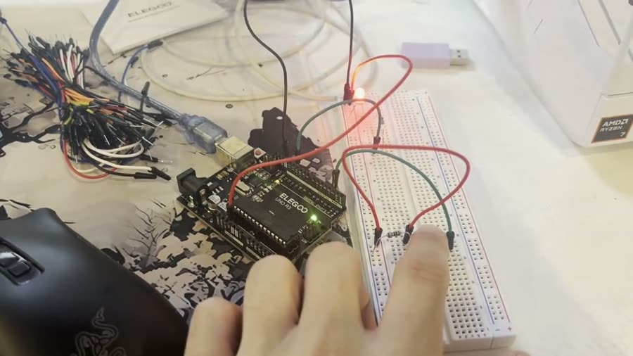](media/04-button-press.mp4)

▶ **[Play the clip](media/04-button-press.mp4)** — Press the button, the LED comes on.

The divide that matters here is `digitalRead` versus `analogRead`. A button answers one bit. A potentiometer answers a number from 0 to 1023, which then has to be divided by 4 to fit the 0–255 that `analogWrite` accepts — the first time a unit mismatch between two APIs actually mattered.

---

### Phase 3 — Sequencing and state: the traffic light

| # | Sketch | What it does |
|---|---|---|
| 05 | [`activity5.ino`](activity5.ino) | Three LEDs on a fixed red → green → yellow cycle |
| 06 | [`activity6.ino`](activity6.ino) | A button toggles between two LED patterns, held in a state variable |
| 07 | [`activity7.ino`](activity7.ino) | The same thing, refactored: pins in an array, behavior in named functions |
| 08 | [`activity8.ino`](activity8.ino) | Retune the cycle's delay by typing a number into the Serial Monitor |

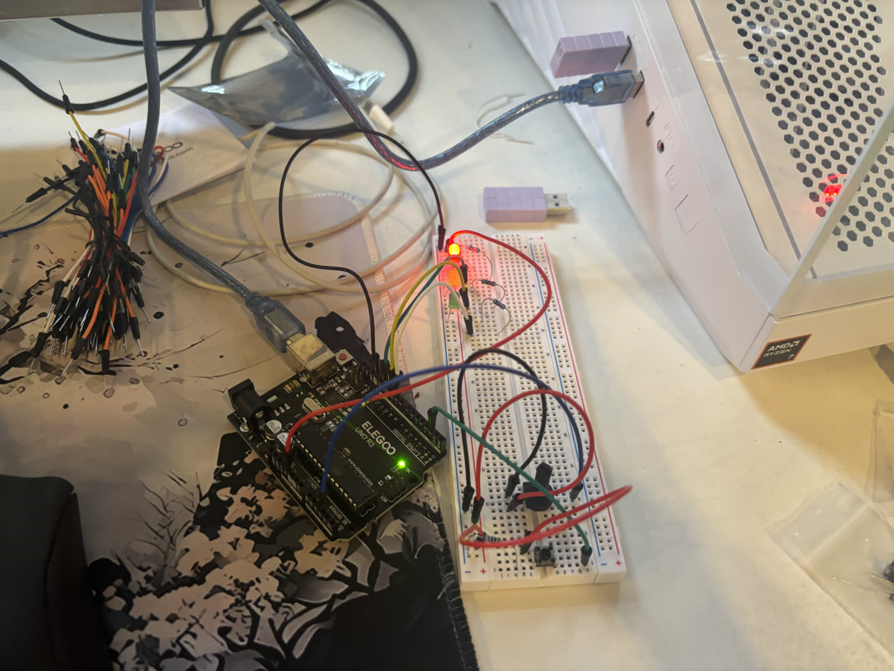

[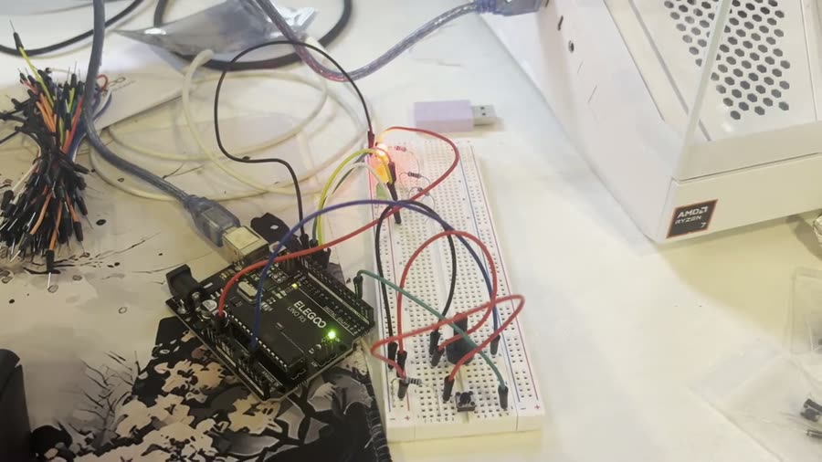](media/05-traffic-light.mp4)

▶ **[Play the clip](media/05-traffic-light.mp4)** — The red - green - yellow cycle running.

Activity 7 is the first refactor rather than a new feature. Activity 6 works, but it repeats `digitalWrite` six times against hardcoded pin names. Activity 7 puts the pins in `LEDPinArray[]` and moves the behavior into `setLEDPinModes`, `turnOffAllLEDs`, and `toggleLEDs` — same output, but adding a fourth LED becomes one array entry instead of a search-and-replace.

[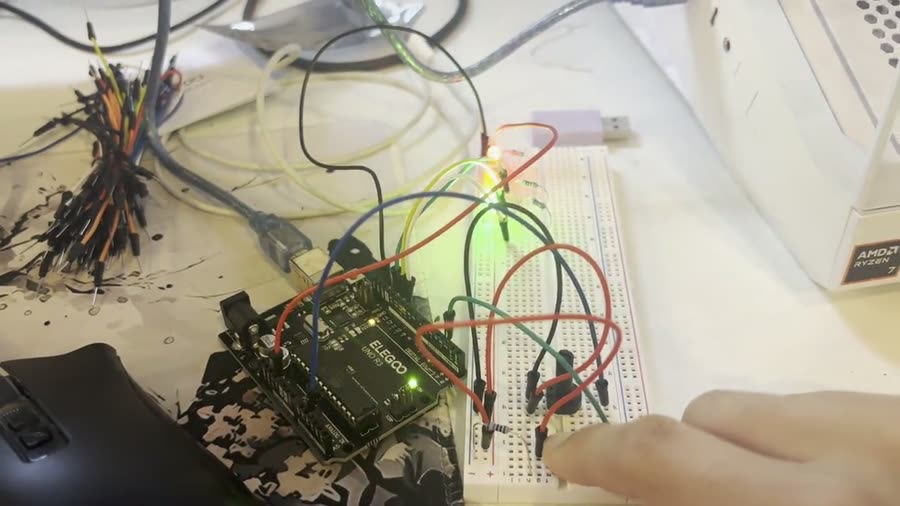](media/07-button-toggles-pattern.mp4)

▶ **[Play the clip](media/07-button-toggles-pattern.mp4)** — A button press swaps between the two LED patterns.

---

### Phase 4 — Time, debouncing, interrupts, and memory

| # | Sketch | What it does |
|---|---|---|
| 09 | [`activity9.ino`](activity9.ino) | Blink using `millis()` instead of `delay()`, so the loop never stops |
| 11 | [`activity11.ino`](activity11.ino) | Blink one LED on a timer while a debounced button toggles two others |
| 12 | [`activity12.ino`](activity12.ino) | Count button presses with `attachInterrupt` on a RISING edge |
| 13 | [`activity13.ino`](activity13.ino) | Cap the potentiometer's brightness at a limit stored in EEPROM |

This is the phase the final project is actually built on.

`delay()` is the problem. In activity 8 the sketch spends most of its life inside a `delay()` and cannot read anything while it's there. Activity 9 replaces it with the pattern used everywhere afterwards: record `millis()`, and each pass through `loop()` check whether enough time has elapsed. The loop keeps spinning, so several timers can run side by side.


Activity 11 is the payoff — an LED blinking on its own schedule while a button is watched at the same time, neither one blocking the other:

[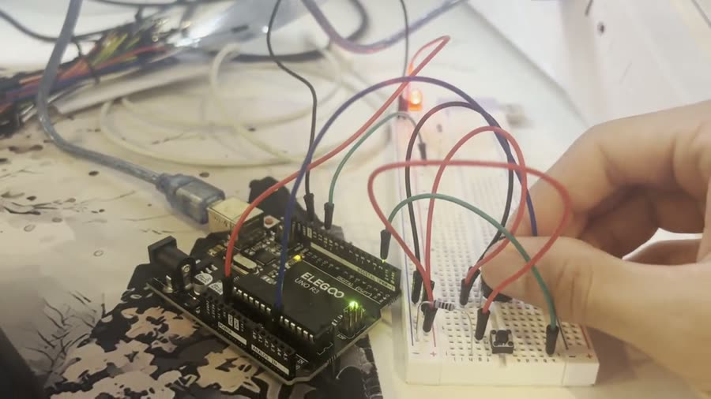](media/11-blink-and-button.mp4)

▶ **[Play the clip](media/11-blink-and-button.mp4)** — One LED blinking on its own timer while the button is watched at the same time.

Debouncing shows up in two forms. The blunt version in activities 6 and 7 is `delay(300)` after a press, which works and stops the sketch. The version in activity 11 compares timestamps and never blocks. Activity 12 then moves the press onto a hardware interrupt, which brings its own rule: an ISR must be short, and anything it shares with `loop()` has to be `volatile` or the compiler will optimize the read away.

EEPROM in activity 13 is the last piece — a setting that survives unplugging the board. Fresh EEPROM reads back as `255`, so a default has to be substituted on first boot.

---

### Phase 5 — Sensors and displays

| # | Sketch | What it does |
|---|---|---|
| 14 | [`activity14.ino`](activity14.ino) | Distance from an HC-SR04 using the blocking `pulseIn()` |
| 15 | [`activity15.ino`](activity15.ino) | The same, but non-blocking via a `CHANGE` interrupt on the echo pin, driving three LEDs by range |
| 16 | [`activity16.ino`](activity16.ino) | Print text typed in the Serial Monitor onto a 16×2 LCD, alternating lines |
| 17 | [`activity17.ino`](activity17.ino) | Live distance on the LCD, smoothed with an exponential filter |
| 18 | [`activity18.ino`](activity18.ino) | Decode an IR remote and toggle LEDs, echoing each command code to the LCD |
| 19 | [`activity19.ino`](activity19.ino) | Photoresistor drives a night-light LED and a second LED's brightness |
| 20 | [`activity20.ino`](activity20.ino) | Rolling average of 100 photoresistor samples, taken every 50 ms |

Activity 14 measures distance the easy way and shows why it isn't good enough: `pulseIn()` blocks until the echo comes back, which at long range is milliseconds of dead time every reading. Activity 15 attaches a `CHANGE` interrupt to the echo pin instead, timestamps the rising and falling edges with `micros()`, and lets `loop()` keep running in between.

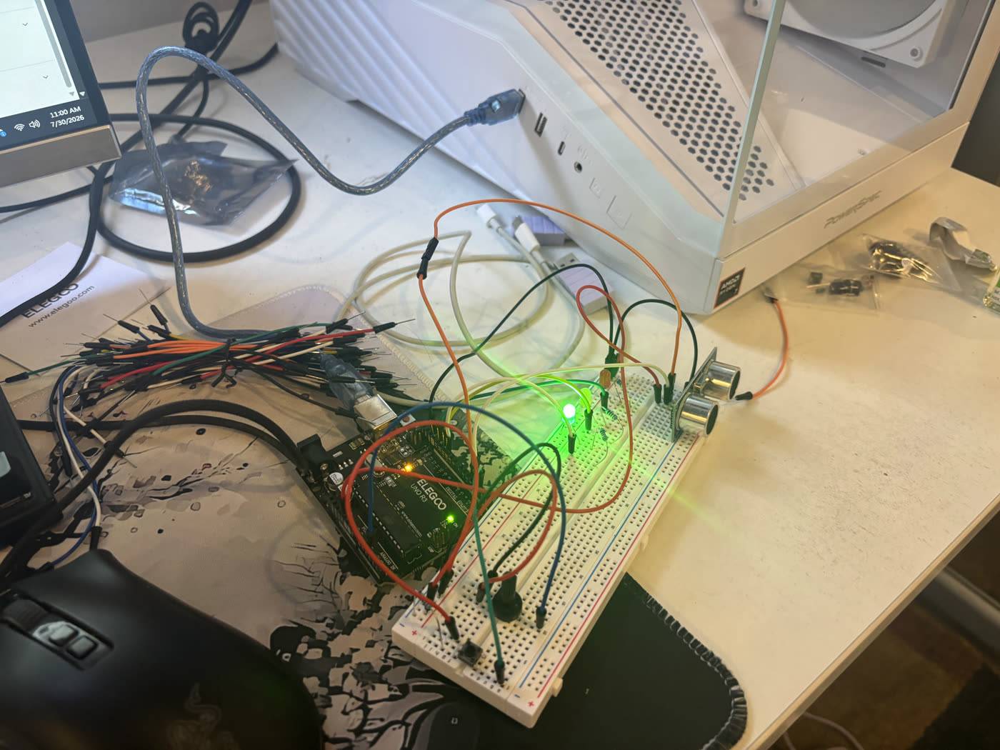

[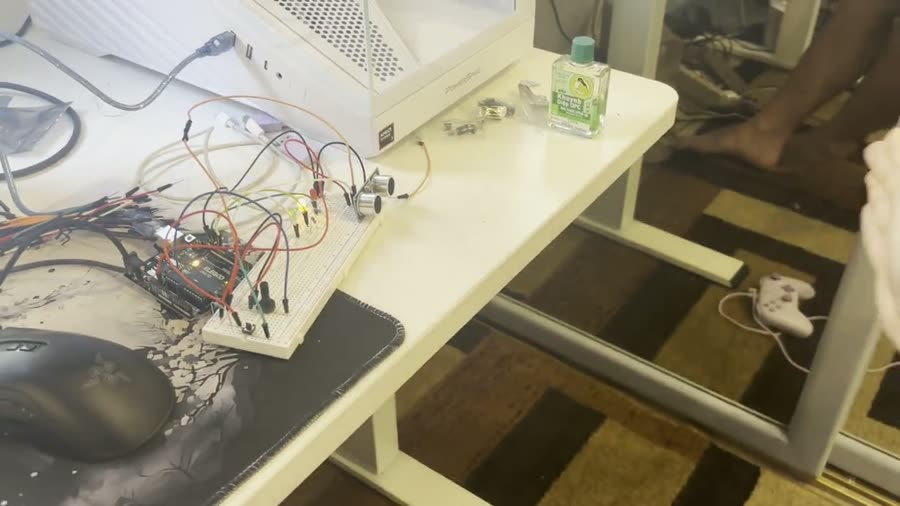](media/15-ultrasonic-range.mp4)

▶ **[Play the clip](media/15-ultrasonic-range.mp4)** — A hand moving toward the sensor, and the LEDs changing with the range.

The LCD arrives in activity 16, in 4-bit mode to save pins. Padding matters more than it looks: the display has no concept of clearing one line, so a shorter string leaves the tail of the previous one on screen unless it's padded out to 16 characters.


Activity 17 puts the two together, and adds the filter. Raw HC-SR04 readings jump around by several centimetres between samples, which is unreadable on a display refreshing 16 times a second. An exponential moving average — `previous * 0.7 + new * 0.3` — settles it without adding real lag.


---

## 🧠 What I Built and Why

I worked through these to get to the point where I could build something that ran on its own hardware rather than on my laptop, and the final project is the reason the list ends where it does. Everything in it — the interrupt-driven rangefinder, the LCD, the IR remote, the EEPROM-backed settings, the `millis()` scheduling that lets all of them run in the same `loop()` — is one of these twenty activities, assembled.

The lesson that transferred furthest was about `delay()`. It is the first tool you're handed and it is the one that has to go: it stops the entire program, so a sketch built on it can only ever do one thing at a time. Rewriting around `millis()` timestamps changes how the whole program is shaped — instead of a script that walks top to bottom, `loop()` becomes a scheduler that runs a hundred times a second and asks each subsystem whether it is due. That is what makes the final project possible, where the sensor, the LEDs, the LCD, the button, the photoresistor, and the IR receiver all appear to run at once on a single-core 16 MHz chip that is only ever doing one of them at a time.

The other thing I didn't expect was how much of the difficulty is physical. A sketch can be correct and the circuit still dead because a jumper is one row off, an LED is backwards, or a button is bridging the wrong side of the breadboard gap. There's no stack trace for that — the debugging loop is serial prints and a multimeter, and it made me a lot more careful about checking the thing I was assuming rather than the thing I'd written.

---

## 📂 Repo Layout

```
LearningArduino/
├── activity1.ino …  activity20.ino   # one sketch per activity, in order
├── media/                            # photos and clips of the builds running
└── README.md
```
